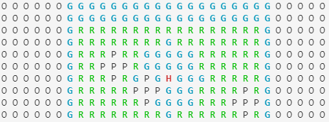
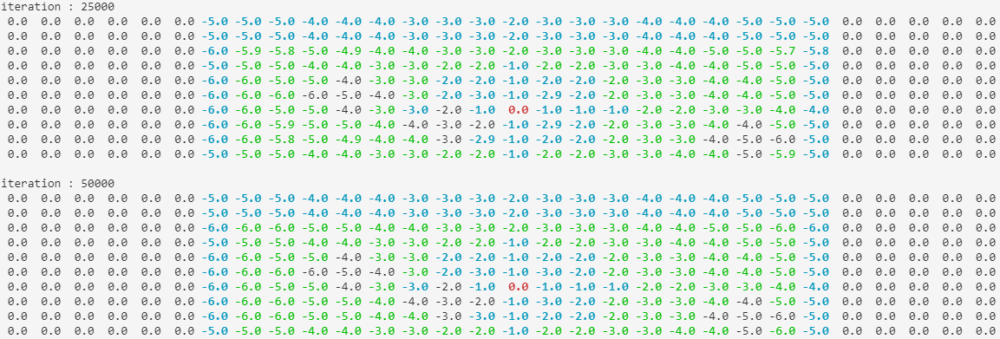
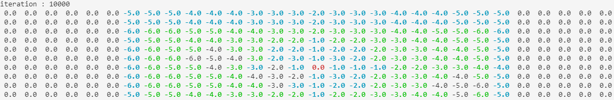

# RL-Golf
This project uses reinforcement learning to find the optimal stroke count for a game of golf. We run Q-Learning and Dyna-Q methods on a designed golf environment, exploring the states and actions with an e-greedy (*e* = 0.1) policy. By running these methods against each other on the same environment, we can see how quickly these methods converge to an optimal solution, and whether or not the model-based planning method is helpful in small, concrete environments. 

## Environment
Our golf environment is composed in a 2D array for WIDTH * HEIGHT, where the states are programatically determined. Each state is assigned a possible value, ['O', 'R', 'G', 'H', 'P'] and each state has a distinctive property:
* O is Out. Out cannot be reached, so running into this state will return the state to a previous one and end the action
* R is Rough. Rough represents a rugged golf terrain, which will modify the action by distance - 1.
* G is Green. Green is a standard golf terrain, which does nothing to the action.
* H is Hole. Hole is the terminal state, which ends each episode.
* P is (Sand) Pit. Sand pits are heavy modifiers that modify the action by distance - 2.

There are two methods that generate environments.
* generate_course -> this creates a randomly generated golf course by selecting a place for the end state (the hole) and generating shapes around it
* generate_test_course -> this creates the same golf course every time

## How to run
Download the repository and ensure that the *random*, *numpy*, and *matplotlib* libraries are supported.
### For Jupyter Notebook
Navigate to the *src* directory and run all cells in the Algorithms notebook. Output shall be printed inside the notebook.
### For Python
Navigate to the *src_py* directory and run the Algorithms file. Output shall be written into the *output* directory.

## Examples
Here are some examples of the converging state estimates - you will also see these as outputs in the Jupyter Notebook.

